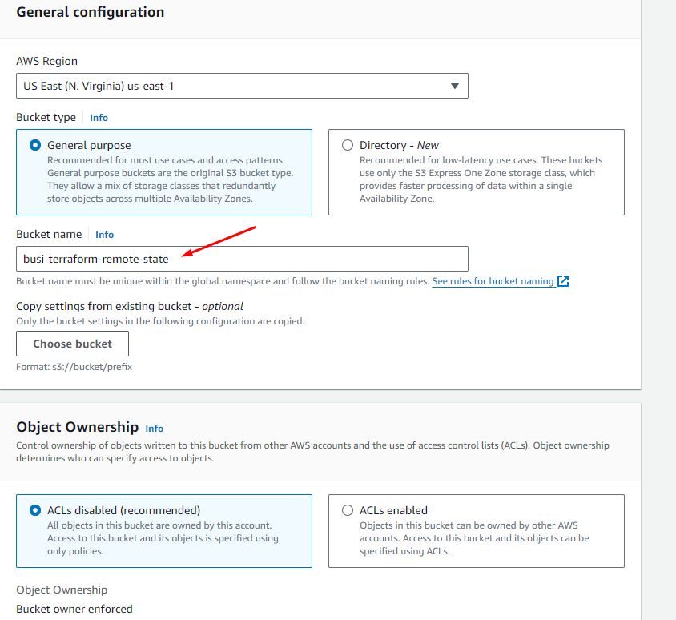
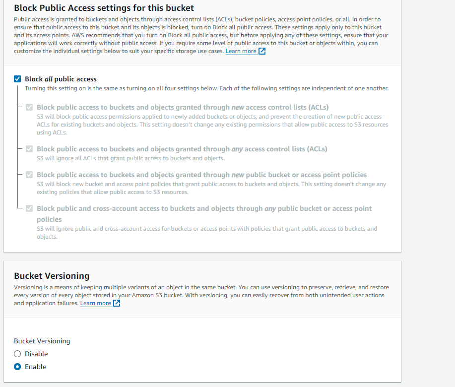
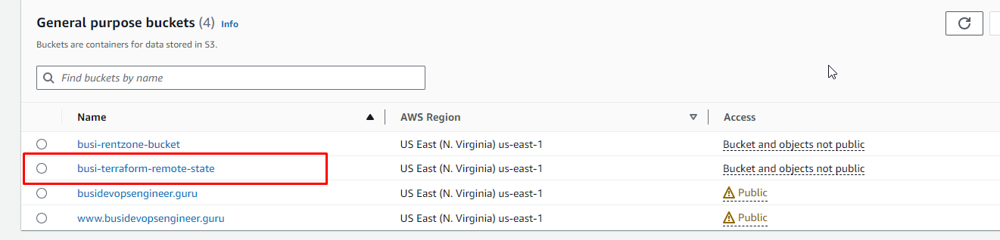

# terraform-docker-ecr-ecs
Deploying a Dynamic Web App on AWS with Terraform Module, Docker, Amazon ECR, and ECS

## Create an S3 Bucket for Storing Terraform State

## How to Create a DynamoDB Table for Locking Terraform State
When you lock your stte with DynamoDb this prevents multiple users making chnges to the state at te same time

DynamoDb -> Tables -> Create Tables
